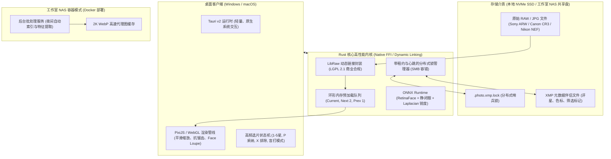
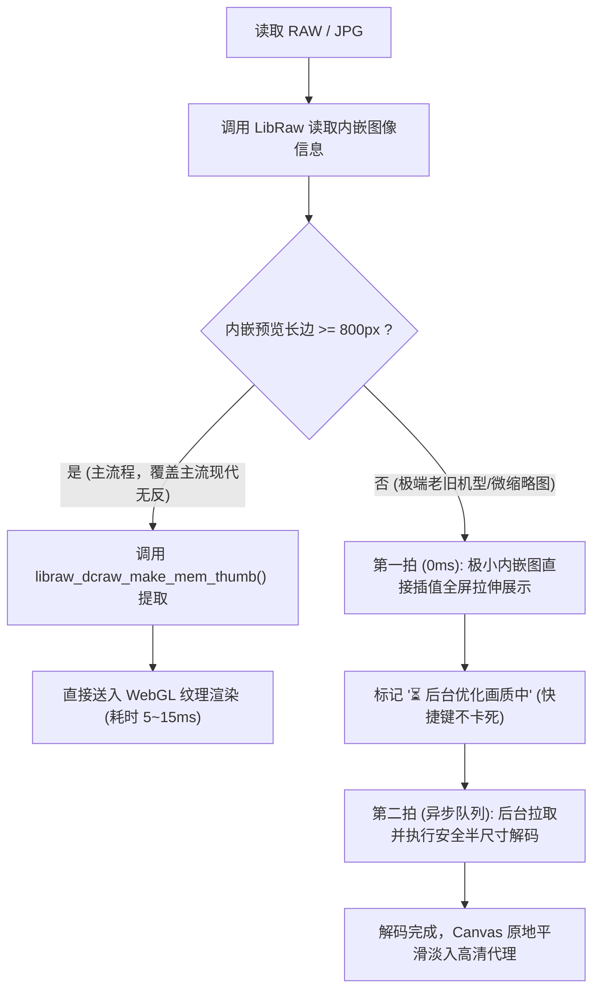
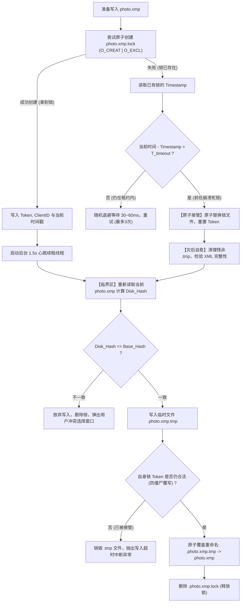

# QuickPick（极选）跨平台照片粗筛与选片系统
## 完整技术架构与工业级开发方案 (V3.1 锁定版)

---

## 目录
1. [项目背景与产品定位](#一-项目背景与产品定位)
2. [总体技术架构与选型](#二-总体技术架构与选型)
3. [RAW 图像引擎与极速渲染管线](#三-raw-图像引擎与极速渲染管线)
4. [XMP 元数据协同与网络锁机制](#四-xmp-元数据协同与网络锁机制)
5. [AI 智能筛选算法与大合影优化](#五-ai-智能筛选算法与大合影优化)
6. [数据隐私与跨端分发规范](#六-数据隐私与跨端分发规范)
7. [双轨研发路线图与交付清单](#七-双轨研发路线图与交付清单)

---

## 一、 项目背景与产品定位

### 1.1 核心痛点与行业背景
在婚礼跟拍、活动外拍、商业肖像等场景下，摄影师单场次拍摄产出的原始照片（RAW/JPG）通常在 **1,000 ~ 5,000 张** 之间。现有的工作流主要存在以下瓶颈：
* **RAW 文件解码沉重**：主流专业软件（Lightroom、Capture One）导入数千张高像素 RAW（如 4500 万至 6000 万像素）需要漫长的构建索引和渲染预览时间，翻页切换存在 1~2 秒黑屏或转圈延迟。
* **连拍表情难以把控**：摄影师常常通过高速连拍抓取瞬间，但几十张微小差异的照片中往往混杂跑焦、半闭眼、尴尬表情等瑕疵片，人工逐张 100% 放大排查极其耗时。
* **多人/多端协同脱节**：商业影楼或工作室往往通过 NAS（群晖、威联通等）集中存储拍摄素材，直接基于局域网 SMB 挂载选片网络延迟极高，且缺乏安全防覆盖机制。

### 1.2 产品定位与核心解法
QuickPick 定位于一款面向 **独立摄影师与专业影像工作室** 的本地优先（Local-First）、全平台照片粗选与初筛工具。

| 核心维度 | 传统工作流 | QuickPick 工业级解法 |
| :--- | :--- | :--- |
| **首屏打开耗时** | 导入并生成全量 1:1 预览（数十分钟~数小时） | **内嵌预览直接渲染**：单张提取延迟仅 5~15ms，真正即开即看 |
| **翻页交互延迟** | 800ms ~ 2,000ms（全尺寸动态解码） | **内存环形预取缓冲**：实现 `< 16ms`（60fps 满帧跟手切换） |
| **连拍冗余处理** | 逐张肉眼比对，极易视觉疲劳 | **时空智能聚类**：连拍自动归组折叠，同屏仅展开 Top 优选 |
| **合焦与闭眼排查** | 反复按快捷键放大至 100% 确认瞳孔 | **多脸联动特写窗格（Face Loupe）**：同屏自动呈现所有人脸 1:1 特写 |
| **后期流水线对接** | 导出耗时，元数据管理分散 | **标准 XMP Sidecar 同步**：无损回写星级/色标，Lightroom 原生无缝导入 |

---

## 二、 总体技术架构与选型

系统采用 **“统一底层计算引擎（Rust） + 跨平台原生壳体（Tauri v2） + 硬件加速渲染层（WebGL/Canvas）”** 的现代化架构。



### 2.1 关键技术选型依据
1. **渲染层（Frontend）**：
   * **框架**：React / Vue 3 + Tailwind CSS。
   * **视图画布**：基于 **Pixi.js / 原生 WebGL**。海量照片高频切换与同屏 2~4 张双向缩放平移时，DOM 节点开销会导致严重卡顿；Canvas 渲染可保证 60~120fps 的丝滑手感。
2. **桌面容器**：**Tauri v2**
   * 放弃 Electron（安装包 150MB+，空载内存 200MB+），选择 Tauri v2。打包产物体积仅 15~25MB，内存占用降低 80%，且支持与 Rust 底层无缝通过 IPC / 共享内存通信。
3. **计算与 IO 内核**：**Rust**
   * 处理密集型文件 IO、异步任务调度、内存安全管理以及 C/C++ 动态链接库的 FFI 桥接。

---

## 三、 RAW 图像引擎与极速渲染管线

### 3.1 LibRaw 商业合规与动态链接标准
为避免陷入自研解析器无法应对相机各版本私有固件差异（MakerNote 偏移、CR3 atom 演变）的工程维护泥潭，项目正式确立**拥抱 LibRaw 动态链接**的技术路线：

* **合规依据（LGPL 2.1 / 3.0）**：
  * LibRaw 以独立动态共享库（macOS 下为 `libraw.dylib`，Windows 下为 `libraw.dll`）的形式分发。
  * QuickPick 专有闭源业务逻辑通过动态链接加载，不侵犯 host 应用程序的专有知识产权，用户具备合规替换该动态库的能力。
  * 在安装包及应用“关于”界面包含 LibRaw 开源声明与协议全文。

### 3.2 图像提取与分级渲染矩阵

放弃先验的 1920px 门槛，修正为贴合现代相机实测表现的 **800px 自适应准则**：



* **主流相机实际内嵌规格说明**：
  * **索尼（Sony A7M3/M4, A7R4/R5）**：压缩 RAW 内嵌全尺寸 JPEG；无损压缩 RAW 内嵌 1616×1080 预览图，全部命中 $\ge 800\text{px}$ 主流程。
  * **佳能（Canon EOS R5/R6/R6 II）**：`PRVW` atom 默认包含 1620×1080 高清预览，全部命中 $\ge 800\text{px}$ 主流程。
  * 在 4K 显示器的工作界面中央，经过双线性/双三次硬件滤波拉伸，上述预览图像素细节与清晰度对选片判定已完全饱和。

### 3.3 降级分支去马赛克算法安全白名单
在极少数 $< 800\text{px}$ 的极端机型触发去马赛克时，为避免引入部分算法的历史专利争议，**强制显式声明调用公有领域（Public Domain）无争议算法**：
```c
// 强制锁定参数，杜绝调用 AHD、DCB 等受争议算法
libraw_data_t *raw_data = libraw_init(0);
raw_data->params.user_qual = 0; // 0 = 纯线性插值（Linear Interpolation），纯净无专利问题
raw_data->params.half_size = 1; // 1 = 强制输出半尺寸，每 2x2 Bayer 像素均值合并，无算法纠纷
```

### 3.4 NAS 场景下的网络 IO 保护机制
* **问题**：`half_size` 需要读取完整 RAW（30~80MB），若在 NAS 网络挂载下直接读取，千兆网络/Wi-Fi 下单张耗时将骤增至 1.5~3 秒。
* **策略**：
  1. **异步可取消队列**：降级解码由单一后台低优先级线程处理。若摄影师在 500ms 内翻至下一张，前一张网络读取与解码任务**立即被 Abort 销毁**，严防挤占网络带宽。
  2. **NAS 预处理提前决策树**：阶段 0 若实测发现老机型在局域网内延迟严重，立即将“NAS 端 Docker 离线批处理生成 2K WebP 缓存”提前至阶段 2 并行开发。

---

## 四、 XMP 元数据协同与网络锁机制

### 4.1 黄金工作流标准（User Journey）
为彻底规避与 Adobe Lightroom 目录数据库（`.lrcat`）不同步引发的投诉，确立推荐工作流规范：

> **推荐流水线：相机拷卡 $\rightarrow$ QuickPick 极速粗选（生成/更新 XMP） $\rightarrow$ 打开 Lightroom 批量导入**

* **技术优势**：Lightroom 在首次导入照片目录时，会**原生自动读取同级目录下的同名 `.xmp` 文件**中的 Rating、Label、Flag 标记，无需配置任何额外选项，体验天然无缝。

### 4.2 XMP 防冲突模型：内容 Hash 与递增版本号
针对 SMB/NFS 挂载下操作系统时钟飘移（NTP 差异）及 FAT32/Samba 默认 2 秒时间戳截断的问题，坚决**放弃脆弱的 `mtime` 判断**，采用 XMP 内容哈希和自定义版本号控制：

```xml
<rdf:Description rdf:about=""
    xmlns:xmp="http://ns.adobe.com/xap/1.0/"
    xmlns:quickpick="http://quickpick.local/ns/1.0/">
  <!-- 标准 Adobe 评级元数据 -->
  <xmp:Rating>5</xmp:Rating>
  <xmp:Label>Red</xmp:Label>
  
  <!-- QuickPick 协同防冲突标识 -->
  <quickpick:rev>4</quickpick:rev>
  <quickpick:contentHash>9f83acde72b4c102a9e3</quickpick:contentHash>
</rdf:Description>
```

### 4.3 带租约的哨兵文件锁（Leased Sentinel Lock）与 TOCTOU 根除方案

在局域网多客户端共享同一目录选片时，采用**原子创建哨兵锁机制**，彻底消除“检查后再写（TOCTOU）”的时间窗口：



#### 关键机制细则：
1. **动态租约基准（Dynamic Timeout）**：
   $$T_{\text{timeout}} = \max\left(8\text{秒},\; 4 \times \text{P99}_{\text{IO}}\right)$$
   本地 SSD 默认取 **8 秒**；NAS 网络波动繁忙期自适应拉长，绝不因瞬时网络抖动误判死锁。
2. **持锁方心跳续约（Heartbeat Refresh）**：
   持锁客户端在写入临界区内，后台异步 Timer **每 1.5 秒更新一次锁文件时间戳**，确保合法慢写入不被抢锁。
3. **防僵尸写入终极安全阀（Zombie Write Guard）**：
   在最后执行原子重命名（Rename）之前的最后一毫秒，程序必须核验磁盘上锁文件的 Token 是否仍为自身。若因严重休眠导致已被他人强行接管，立即销毁临时文件并主动退出，杜绝脑裂覆盖。
4. **接管后的灾后自愈（Crash Recovery）**：
   接管者绝不盲目覆写，强制检查并清理前任遗留的残破 `.tmp` 垃圾文件，对主 `.xmp` 做 XML/RDF 语法完整性验证，若已损坏则基于客户端内存快照自愈修复。

---

## 五、 AI 智能筛选算法与大合影优化

### 5.1 场景预设（Presets）与参数滑杆
放弃通用单一加权公式，确立 3 大摄影细分场景预设，并允许用户通过 UI 滑杆微调敏感度：

* **预设 A：婚礼跟拍 / 抓拍（Candid & Ceremony）**
  * 策略：抓取真情实感。允许轻微运动模糊，坚决排除半闭眼。
  * 默认权重：$\text{EyeStatus}$ 占 45%，$\text{Smile/Expression}$ 占 35%，$\text{Sharpness}$ 占 20%。
* **预设 B：肖像摆拍 / 婚纱大片（Posed Portrait）**
  * 策略：焦点必须极度锐利，画面构图严苛。
  * 默认权重：$\text{Sharpness}$ 占 50%，$\text{EyeStatus}$ 占 30%，$\text{Aesthetic}$ 占 20%。
* **预设 C：大合影 / 敬酒环节（Group Photo）**
  * 策略：全员无闭眼一票否决制。

### 5.2 大合照人脸风暴处理（Face Loupe 防撑爆）
婚礼大合影（几十人同框）若将所有人脸铺满特写，将造成界面不可用与系统卡死。

#### 严格归一化人脸优先级模型：
设画面宽为 $W$，高为 $H$，画面对角线 $D = \sqrt{W^2 + H^2}$。
某人脸外接矩形为 $(x, y, w, h)$，中心点为 $(c_x, c_y)$：
1. **归一化人脸面积占比**：
   $$\text{NormArea} = \frac{w \cdot h}{W \cdot H} \in [0, 1]$$
2. **归一化中心距离偏离度**：
   $$\text{NormDist} = \frac{\sqrt{(c_x - \frac{W}{2})^2 + (c_y - \frac{H}{2})^2}}{0.5 \cdot D} \in [0, 1]$$
3. **主角手动钉选（Pinning）**：
   $$\text{IsPinned} \in \{0, 1\}$$

**人脸特写展示优先级公式**：
$$\text{Priority} = 10 \cdot \text{IsPinned} + 5 \cdot \text{NormArea} - 2 \cdot \text{NormDist}$$

#### 大合影界面呈现规则：
* **特写窗格上限**：底部/侧边最多仅展示 **Top 6** 最高优先级的人脸特写（保证新郎新娘及前景重要人物展示）。
* **主角人脸记忆**：摄影师在首张合影中“钉选”新人面部后，后续连拍组自动继承这两张人脸特写在第 1、2 窗格展示。
* **闭眼一票否决浮动气泡**：未进入特写列表的其余背景人脸，若算法检测到其睁眼度 $< 0.3$，主图对应人脸上方弹出闪烁提示（`⚠️ 伴郎 B 闭眼`），点击气泡界面视口瞬跳至该位置，兼顾全局与细节。

---

## 六、 数据隐私与跨端分发规范

### 6.1 100% 本地化隐私保证（Local-First）
* **红线要求**：婚礼客照涉及客户肖像及私密场景，所有人脸检测、特征比对、美学打分模型（ONNX 格式）**100% 离线打包在客户端二进制包中**，不设任何云端模型回传接口。
* **NAS 隔离缓存**：NAS 扫描服务生成的索引与 WebP 缓存存放于目录级受保护的隐藏文件夹 `.quickpick_cache` 中，遵从主机权限隔离策略。

### 6.2 跨平台分发与操作系统公证（CI/CD 流水线）
解决非技术用户在安装时遭遇系统拦截的痛点：
* **macOS 自动化公证**：
  * 配置 Apple Developer ID 应用程序证书。
  * 构建时启用 Hardened Runtime，通过 GitHub Actions 调用 `xcrun notarytool` 提交苹果官方公证，并执行 `stapler` 缝合票据。
* **Windows 代码签名**：
  * 引入 Azure Trusted Signing 或标准 EV Authenticode 代码签名证书，建立 SmartScreen 信任评级，杜绝未知发布者黄色风险弹窗。

---

## 七、 双轨研发路线图与交付清单

项目开发彻底摒弃“外部协调拖垮工程进度”的单链条模式，采取 **工程研发线** 与 **商务/外部协调线** 独立计时的双轨推进策略：

```
════════════════════════════════════════════════════════════════════════════════════════════════════════
【阶段 0：前置技术验真 + 商务假设验证 (2 ~ 4 周)】
────────────────────────────────────────────────────────────────────────────────────────────────────
[工程轨 - 团队完全自主可控 (2 周)]
 ├── 任务 0.1：搭建 LibRaw LGPL 动态链接 Rust FFI 基础脚手架，测试动态库随包分发
 ├── 任务 0.2：获取真实机型（Sony A7M4/A7R5、Canon R5/R6 等）测试内嵌预览提取耗时与覆盖率
 ├── 任务 0.3：实测降级分支 `user_qual=0 + half_size=1` 在本地 SSD 与 NAS SMB 挂载下的端到端耗时
 └── 交付物 0.A：《主流机型内嵌预览实测矩阵报告》、《跨平台动态链接骨架工程》

[商务/调研轨 - 弹性推进 (3 ~ 5 周，平行延伸至阶段 1)]
 ├── 任务 0.4：深度访谈 6~8 位一线商业摄影师与修图师，验证 NAS 协同真实痛点与使用频次
 ├── 任务 0.5：联络 3 家友好影像工作室，启动素材授权谈判，获取 5 套脱敏历史客照全量 RAW 与 Final Picks
 └── 交付物 0.B：《摄影师选片工作流真实调研报告》、《5套标准算法校准测试集》
════════════════════════════════════════════════════════════════════════════════════════════════════════
【阶段 1：MVP 核心极速选片引擎交付 (6 ~ 8 周)】
────────────────────────────────────────────────────────────────────────────────────────────────────
 ├── 范围约束：重点支持 Sony ARW + Canon CR3 + 通用 JPG
 ├── 核心组件：
 │    ├─ Tauri v2 跨端框架与原生窗口生命周期打通
 │    ├─ 基于 Pixi.js/WebGL 的极速照片渲染画布（支持平滑缩放、双向拖拽）
 │    ├─ 环形多级预加载调度器（当前张 + 预取后 2 张，翻页响应 < 16ms）
 │    ├─ 渐进式展示引擎（微小图先拉伸上屏，异步平滑替换）
 │    ├─ 带租约哨兵锁（.xmp.lock）与内容哈希防冲突 XMP 写入模块
 │    └─ 键盘盲打选片状态机（1-5 评星、P 标记、X 排除、自动跳张）
 └── 交付物 1.A：可在 macOS / Windows 上原生运行且完成代码签名的 MVP 桌面客户端
════════════════════════════════════════════════════════════════════════════════════════════════════════
【阶段 2：AI 核心模型与大合影工程化 (6 ~ 8 周)】
────────────────────────────────────────────────────────────────────────────────────────────────────
 ├── 核心组件：
 │    ├─ ONNX Runtime 跨平台推理集成（Mac Metal / Win DirectML 硬件加速）
 │    ├─ 连拍时空聚类算法（EXIF 毫秒时间戳 + 感知哈希折叠）
 │    ├─ 人脸检测、眼睛开合状态识别与瞳孔合焦锐度评估
 │    ├─ 归一化 Face Priority 算法、Top 6 特写窗格展示与主角人脸锁定
 │    └─ 3 大场景预设及摄影师微调滑杆落地
 └── 数据验收：基于商务轨交付的 5 套真实实拍数据集，跑回归测试验证 AI 推荐准确率
════════════════════════════════════════════════════════════════════════════════════════════════════════
【阶段 3：NAS 协同与工作室生产力扩展 (4 ~ 6 周)】
────────────────────────────────────────────────────────────────────────────────────────────────────
 ├── 动态定级：根据阶段 0 调研报告结论分配开发资源
 ├── 核心组件：
 │    ├─ 群晖 / 威联通 Docker 无头后台扫描服务（空闲期预生成索引与 2K WebP 代理）
 │    ├─ 局域网协同模式（免传输原始 RAW 文件，秒级拉取轻量代理与元数据）
 │    └─ 导出流水线打通（无缝导出至 Lightroom 目录、Capture One 会话及网盘同步）
 └── 交付物 3.A：QuickPick Studio NAS 协同套件及完整工程安装指南
════════════════════════════════════════════════════════════════════════════════════════════════════════
```

---

## 八、 总结
本方案已全方位完成技术避坑与工业级加固：
1. **合规落地**：确立 LibRaw LGPL 动态链接与降级纯线性插值，杜绝商业知识产权隐患；
2. **性能闭环**：采用 800px 自适应阈值、小图先拉伸展示以及异步可取消机制，杜绝 NAS 场景网络阻塞；
3. **高可用协同**：引入内容哈希比对、带心跳续租的哨兵文件锁与接管自愈机制，彻底消灭 TOCTOU 竞态与假死锁；
4. **科学严谨**：通过量纲归一化与 Top 6 限制保障大合照交互可用，通过双轨制解决外部商务排期拖垮工程的痼疾。

本方案已具备极高的工程可执行性，可作为研发团队正式交底与验收基准。
