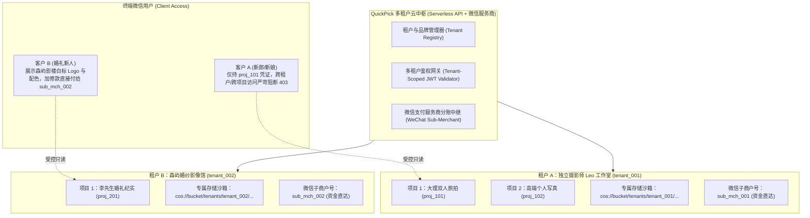
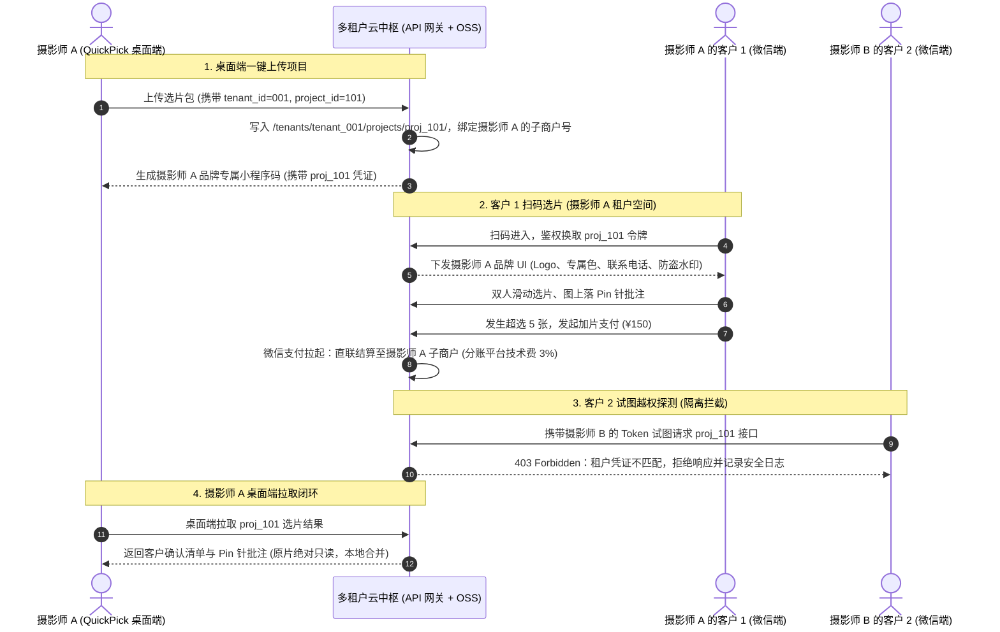

# QuickPick（极选）多租户移动端协同选片小程序规划方案与 TODO 清单

> **文档定位**：面向 QuickPick 商业化云协同扩展的核心架构文档，专用于记录**多租户微信选片协同小程序（QuickPick Mobile / Mini-Program）**的产品定义、多租户隔离体系、交互体验、商业变现与分阶段 TODO 清单。  
> **制定时间**：2026-09-09（根据多租户隔离要求深化更新）  
> **核心架构原则**：
> 1. **桌面端绝对只读与本地优先**：原片不修改、不移动，仅导出轻量 2K WebP 预览图上云；
> 2. **多租户全方位严格隔离**：支持成千上万个摄影师/工作室（租户）同时服务海量客户，**租户间、项目间、客户间在数据存储、鉴权令牌、品牌白标、微信支付分账上实现 100% 物理与逻辑隔离**，杜绝任何越权串门风险。

---

## 一、 项目背景与商业化多租户愿景

### 1.1 现实痛点（当前行业现状）
1. **选片服务分散脆弱**：每个摄影师或影楼各自用网盘发片、微信对表，缺少统一、免安装、体验极佳的移动选片工具；
2. **多租户共享风险高**：市面上偶有的选片系统若多租户设计不当，极易发生“客户A看到客户B的私密照片”、“摄影师A看到摄影师B的订单流水”等严重安全与隐私事故；
3. **资金流合规（二清）风险**：若平台统收客户加选费再人工打款给摄影师，会陷入“资金池”与“无证二清”的金融合规风险；必须依赖多租户子商户分账体系。

### 1.2 QuickPick 多租户平台定位
打造一个**高隔离、去中心化品牌感（White-Label）、开箱即用的多租户选片云平台**：
- **对于摄影师/工作室（Tenant）**：一键在桌面端 QuickPick 分发项目，获得专属小程序码，客户看到的完全是摄影师自己的品牌形象，加选费用直接打入摄影师自身商户号；
- **对于终端客户（Client）**：无需下载 App，双人实时连线、滑动选片、指尖精准 Pin 针批注、超选一键微信支付；
- **对于平台运营方（Platform）**：零重型存储与计算运维负担，通过微信支付服务商分账或 SaaS 订阅按需盈利。

---

## 二、 多租户架构与全方位隔离体系

### 2.1 实体层次结构模型（Tenant Hierarchy）
* **Level 1：平台级（Platform）**
  * 统筹微信小程序主体资质、微信支付服务商牌照、底层 Serverless 资源池与计费体系。
* **Level 2：租户级（Tenant / Studio / Photographer）**
  * 独立摄影师、摄影工作室或影楼法人实体；
  * 拥有唯一的全局不可篡改 `tenant_id`；
  * 包含专属配置：品牌名称、Logo、专属主题色、客服电话、水印规则、绑定的微信支付特约子商户号（`sub_mchid`）、选片单价标准。
* **Level 3：项目/场次级（Project / Session）**
  * 单次拍摄的选片工程（如 `“20261001-张先生李女士婚礼”`）；
  * 隶属于唯一 `tenant_id`，拥有 `project_id`、套餐包含张数配额、访问截止日期、动态提取口令。
* **Level 4：终端客户与协选人（Client / Co-Picker）**
  * 微信用户 OpenID，通过特定项目的邀请链接/口令进入；
  * 角色包括：**主客户（Primary Client）**与**受邀协同人（Co-Picker，如伴侣、长辈）**。

---

### 2.2 五重核心隔离机制（Strict Isolation Matrix）

| 隔离维度 | 技术实现方式 | 达成的安全与业务效果 |
| :--- | :--- | :--- |
| **1. 存储与资源隔离** | 对象存储路径强制前缀： `/tenants/{tenant_id}/projects/{project_id}/assets/` | 云端签发限时短效 Presigned URL，作用域仅限于单个项目目录，**无法通过暴力遍历 URL 爬取其他租户或项目的照片**。 |
| **2. 数据行级安全隔离 (RLS)** | 数据库所有业务表（projects, selections, pins, orders）复合主键均包含 `(tenant_id, project_id)` | API 网关中间件自动校验并强行注入当前 Token 的 `tenant_id` 与 `project_id` 查询过滤条件，**代码层禁止跨租户查询，杜绝水平越权**。 |
| **3. 鉴权令牌与防越权** | 双重绑定 JWT：`ProjectAccessToken` 携带 `tenant_id`, `project_id`, `client_role`, `exp` | 客户凭 A 项目的 Token 访问 B 项目或 B 租户接口时，网关在解析阶段直接拒绝（HTTP 403 Forbidden）。 |
| **4. 品牌白标隔离 (White-Label)** | 小程序动态主题配置（Dynamic Theming）：根据当前项目的 `tenant_id` 动态加载影楼 Logo、名称、配色 | **客户全程无感第三方平台存在**，客户看到的是“Leo 摄影工作室官方选片”，保护摄影师私域流量与品牌专业度。 |
| **5. 资金与支付隔离** | 接入**微信支付服务商模式（特约商户分账）** | 客户购买超选加片时，资金直接打入摄影师自身子商户号，平台按约定规则分账扣取微量技术服务费，**杜绝资金池，合规无二清风险**。 |

---

## 三、 用户旅程与多租户端到端交互

---

## 四、 核心功能模块详细设计

### 4.1 摄影师端：租户入驻与工作台（Studio Tenant Console）
* **租户身份初始化**：
  * 在桌面端设置中录入摄影师/工作室账号（或微信扫码入驻）；
  * 配置品牌信息：工作室名称、自定义 Logo、专属客服微信、防盗透明水印文字；
  * 配置收款子商户：一键绑定微信支付商户号（或协助开通微信服务商特约商户）。
* **项目打包与配额分发**：
  * 选定要让客户二选的候选片（如 300 张）；
  * 设定套餐精选张数配额（如 40 张）与加选单价（如 ¥35/张）；
  * Rust 引擎自动生成 2K WebP 并加密上传至该租户的专用存储路径下。

### 4.2 客户端：白标双人沉浸选片（White-Label Client Mini-Program）
* **定制化品牌呈现**：
  * 客户打开小程序，顶部展示摄影师专属 Logo，无任何平台冗余广告；
  * 照片自带轻量防截屏与摄影师定制半透明防盗水印。
* **情侣双人协同决策**：
  * 微信一键邀请伴侣，双方各自打勾；
  * 智能归集【双方共识必选区】与【待讨论商榷区】，避免沟通冲突；
  * 故事线章节分段（早妆、迎亲、仪式、晚宴），进度清晰直观。
* **指尖视觉批注（Visual Pins）**：
  * 双指平滑缩放，长按精准落针；
  * 8 大高频快捷标签：`[面部微调]`、`[修除碎发]`、`[除背景杂物]`、`[牙齿美白]`等，无需打字。
* **超选在线结算**：
  * 顶部动态仪表盘：“套餐已含 40 张，当前选入 45 张（超选 5 张，需补 ¥175）”；
  * 点击一键调起微信支付，资金直达该摄影师的商户账户。

### 4.3 桌面端：闭环反向同步（One-Click Sync-Back）
* 客户提交后，摄影师桌面端状态栏亮起提醒；
* 点击“同步拉取”，本地 SQLite 数据库秒级合并客户的选择标记与 Pin 针批注；
* 原片绝对只读、不移动，按快捷键 `R` 即可在原片大图上复查客户批注，一键导出《修图指示书.html》交付后期。

---

## 五、 多租户技术栈与部署方案

| 模块 | 技术选型 | 多租户支持要点 |
| :--- | :--- | :--- |
| **小程序端** | Uni-app (Vue 3 + TS) | 动态 CSS 变量主题切换、动态读取 Tenant Brand 配置、全套微信生态 API |
| **云端 API 网关** | Serverless (微信云开发 / Node.js / Go) | 强制中间件统一校验 `tenant_id` 与 `project_id`，防止水平越权 |
| **多租户数据库** | PostgreSQL / 微信云数据库 (文档型) | 表级与集合级 `tenant_id` 复合主键索引，支持逻辑隔离与行级安全 (RLS) |
| **对象存储 (OSS)** | 腾讯云 COS / 阿里云 OSS | 目录物理隔离，STS 临时密钥按项目前缀授权只读，防盗链与防盗刷限制 |
| **支付与清算** | 微信支付服务商 (WeChat Pay Partner) | 特约商户进件 API、服务商分账接口，合规免资金池清算 |

---

## 六、 多租户开发实施 TODO 路线图

### Phase 1：多租户数据模型与安全隔离基座（基础安全与分发）
- [ ] **1. 多租户数据字典与表结构设计**
  - [ ] 设计 `tenants` 表（租户ID、摄影师名称、Logo、品牌配置、分账子商户号、SaaS套餐到期时间）
  - [ ] 设计 `projects` 表（包含 `tenant_id`, `project_id` 复合主键、故事线章节JSON、配额、加片单价）
  - [ ] 设计 `client_sessions` 表（用户OpenID、租户ID、项目ID、角色：主客户/协商人）
  - [ ] 设计 `selections` 与 `visual_pins` 表（强制带有 `tenant_id` + `project_id` 索引）
- [ ] **2. 多租户鉴权与访问控制中间件**
  - [ ] 实现 `TenantScopedAuthMiddleware`：解析 JWT，强制拦截任何跨租户、跨项目的请求（403 Forbidden）
  - [ ] 实现 STS 临时存储密钥签发服务：仅签发当前租户当前项目目录的限时只读权限
- [ ] **3. 桌面端租户接入与打包上传**
  - [ ] 桌面端设置页增加“摄影师/工作室租户身份配置”
  - [ ] 导出选片包时自动注入 `tenant_id` 并上传至对应对象存储路径
  - [ ] 生成携带 `tenant_id` 与 `project_id` 的专属小程序分享卡片与小程序码

### Phase 2：白标小程序与协同选片体验（移动端体验）
- [ ] **4. 移动端动态白标与品牌渲染**
  - [ ] 小程序启动时按项目参数拉取租户品牌配置（Logo、色调、名称），动态应用 UI 主题
  - [ ] 预览图半透明动态水印注入（包含租户品牌标识与防盗截屏提示）
- [ ] **5. 双人协同选片模式**
  - [ ] 微信一键邀请伴侣绑定到同一项目
  - [ ] 实时同步两人的喜欢/放弃状态，划分【双方共识必选区】与【商榷讨论区】
  - [ ] 故事线（Storyline）章节分段卡片式浏览
- [ ] **6. 指尖视觉批注（Mobile Visual Pins）**
  - [ ] Canvas 硬件加速多点触控缩放与长按精准落针
  - [ ] 8 大高频需求快捷标签气泡选择器与自定义文字备注

### Phase 3：多租户商业化变现与闭环同步（商业闭环）
- [ ] **7. 微信支付服务商子商户分账接入**
  - [ ] 租户端协助完成特约商户进件与授权绑定
  - [ ] 小程序端根据超选张数与单价实时生成加选订单
  - [ ] 调起微信支付直接结算至对应租户商户号，自动执行平台技术服务费分账
- [ ] **8. 虚拟画册跨页排版移动端渲染**
  - [ ] 移动端模拟精装相册双页翻阅排版
  - [ ] 智能提示“还差 X 张即可排满一个完整跨页”，激发客户加选冲动
- [ ] **9. 桌面端一键闭环拉取**
  - [ ] 桌面端项目状态栏实时提示客户提交与加选情况
  - [ ] 一键拉取远程选片决定与 Pin 针批注，本地 SQLite 原子合并（原片绝对只读）
  - [ ] 导出包含客户线上加选与批注的交付级《修图指示书.html》
